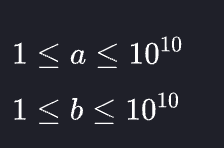
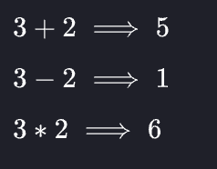

The provided code stub reads two integers from STDIN, `a` and `b`. Add code to print three lines where:

`1.` The first line contains the sum of the two numbers.
`2.` The second line contains the difference of the two numbers (first - second).
`3.` The third line contains the product of the two numbers.

Example

`a = 3`
`b = 5`

Print the following:

```
8
-2
15
```

Input Format

The first line contains the first integer, `a`.
The second line contains the second integer, `b`.

Constraints



Output Format

Print the three lines as explained above.

Sample Input 0

```
3
2
```

Sample Output 0

```
5
1
6
```

Explanation 0


