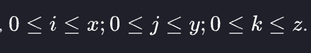
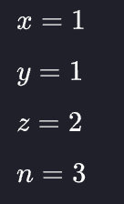
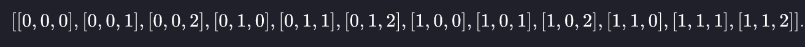
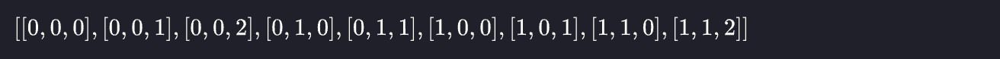
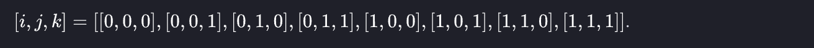

Let's learn about list comprehensions! You are given three integers `x`, `y` and `z` representing the dimensions of a cuboid along with an integer `n`. Print a list of all possible coordinates given by `(i, j, k)` on a 3D grid where the sum of `i+j+k` is not equal to `n`. Here, . Please use list comprehensions rather than multiple loops, as a learning exercise.

Example



All permutations of `[i,j,k]` are:



Print an array of the elements that do not sum to `n=3`.



Input Format

Four integers `x,y,z` and `n`, each on a separate line.

Constraints

Print the list in lexicographic increasing order.

Sample Input 0

```
1
1
1
2
```

Sample Output 0

`[[0, 0, 0], [0, 0, 1], [0, 1, 0], [1, 0, 0], [1, 1, 1]]`

Explanation 0

Each variable and will have values of `0` or `1`. All permutations of lists in the form

.

Remove all arrays that sum to to leave only the valid permutations.

Sample Input 1

```
2
2
2
2
```

Sample Output 1

```
[[0, 0, 0], [0, 0, 1], [0, 1, 0], [0, 1, 2], [0, 2, 1], [0, 2, 2], [1, 0, 0], [1, 0, 2], [1, 1, 1], [1, 1, 2], [1, 2, 0], [1, 2, 1], [1, 2, 2], [2, 0, 1], [2, 0, 2], [2, 1, 0], [2, 1, 1], [2, 1, 2], [2, 2, 0], [2, 2, 1], [2, 2, 2]]
```
